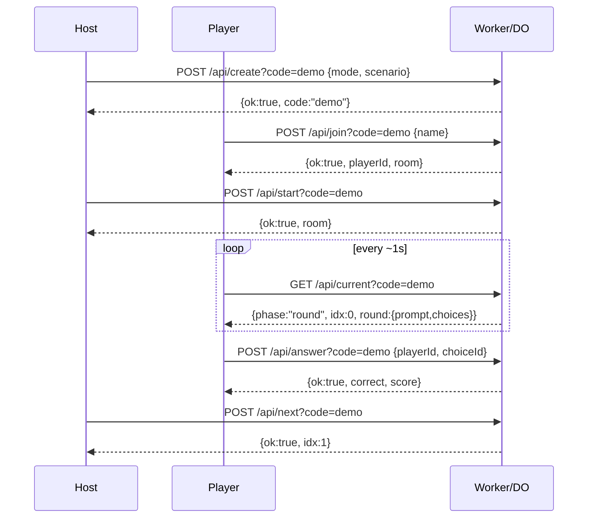

Here’s a tight **API surface reference** for your game Worker + Durable Object. Copy into your README or `/docs/api.md`.

# API Reference

Base URL: your Worker origin (e.g. `https://…workers.dev`)
All routes are **JSON over HTTP**. Polling model (no websockets).

---

## Objects

**RoomState (public)**

```json
{
  "code": "demo",
  "mode": "serious|funny|easter",
  "title": "The Lunch Break Breach",
  "phase": "lobby|round|results",
  "idx": 0,
  "players": [{ "id": "uuid", "name": "Alex", "score": 10 }]
}
```

**Round (redacted to players)**

```json
{
  "id": "r1",
  "prompt": "Question…",
  "choices": [{ "id": "A", "text": "Option…" }]
}
```

**Error**

```json
{ "ok": false, "error": "Message" }
```

---

## Endpoints

### 1) Create Room

`POST /api/create?code=<ROOM_CODE>`

**Body**

```json
{
  "mode": "serious|funny|easter",
  "scenario": { "title": "...", "rounds": [ ... ] }   // optional; if omitted, a built-in fallback is used
}
```

**Response**

```json
{ "ok": true, "code": "demo", "mode": "serious", "title": "The Lunch Break Breach" }
```

**Notes**

* Idempotent per `code`: re-creates a fresh lobby for that code.
* Used by **host**. In Easter flow the host posts the unlocked scenario.

---

### 2) Join Room

`POST /api/join?code=<ROOM_CODE>`

**Body**

```json
{ "name": "Alex" }
```

**Response**

```json
{
  "ok": true,
  "playerId": "2c9e5a3e-4d79-4a85-9e2e-…",
  "room": { /* RoomState (public) */ }
}
```

**Notes**

* Save `playerId` in localStorage. Needed for answering.

---

### 3) Start Game

`POST /api/start?code=<ROOM_CODE>`

**Response**

```json
{ "ok": true, "room": { /* RoomState */ } }
```

**Notes**

* Transitions `phase: lobby → round`, sets `idx = 0`.
* Host-only action (UI enforces; no auth in starter).

---

### 4) Get Current Round / Phase

`GET /api/current?code=<ROOM_CODE>`

**Response**

```json
{
  "ok": true,
  "phase": "lobby|round|results",
  "idx": 0,
  "round": { /* redacted Round, or null if lobby/results */ }
}
```

**Notes**

* Players poll this \~1–1.5s for live updates.

---

### 5) Submit Answer

`POST /api/answer?code=<ROOM_CODE>`

**Body**

```json
{ "playerId": "<uuid>", "choiceId": "A" }
```

**Response**

```json
{ "ok": true, "correct": true, "score": 20 }
```

**Notes**

* One answer per player per round. Subsequent calls return `{ ok: true, already: true, score: … }`.

---

### 6) Next Round

`POST /api/next?code=<ROOM_CODE>`

**Response**

```json
{ "ok": true, "idx": 1 }           // or { "ok": true, "phase": "results" } on last round
```

**Notes**

* Host-only action. Advances `idx` or ends game → `phase: results`.

---

### 7) Scoreboard

`GET /api/scoreboard?code=<ROOM_CODE>`

**Response**

```json
{
  "ok": true,
  "players": [
    { "id": "…", "name": "Alex", "score": 30 },
    { "id": "…", "name": "Sam", "score": 20 }
  ]
}
```

**Notes**

* Sorted descending by score. Hosts poll every \~1.5s.

---

## Typical Flows

### Host Flow

1. `POST /api/create?code=demo` (optionally include `scenario`)
2. Share code `demo`
3. `POST /api/start?code=demo`
4. For each question: `POST /api/next?code=demo`
5. After last: `phase = results`

### Player Flow

1. `POST /api/join?code=demo` → store `playerId`
2. Poll `GET /api/current?code=demo`
3. On round: `POST /api/answer` with `playerId`, `choiceId`
4. Continue polling until `phase = results`

---

## Status Codes

* `200` success (`{ ok: true, ... }`)
* `400` bad request (missing fields, wrong phase)
* `404` bad route
* `500` unhandled server error

---

## Curl Examples

**Create**

```bash
curl -X POST "https://…/api/create?code=demo" \
  -H "content-type: application/json" \
  -d '{ "mode":"serious" }'
```

**Join**

```bash
curl -X POST "https://…/api/join?code=demo" \
  -d '{ "name": "Alex" }'
```

**Answer**

```bash
curl -X POST "https://…/api/answer?code=demo" \
  -H "content-type: application/json" \
  -d '{ "playerId":"<uuid>", "choiceId":"B" }'
```

---

## Constraints & Notes

* **No auth** in starter. Treat as a friendly team game. If needed, add:

  * A host PIN on `/api/create` and gate `/api/start` & `/api/next`.
* **Single room per code.** Default code is `demo`. For concurrent games, generate unique codes and pass `?code=...` everywhere.
* **Easter Egg**: host taps title 7× → UI loads `data/easter-egg.json` and posts it with `mode:"easter"` to `/api/create`.
* **Scoring**: per-round `points` (from scenario JSON) added on correct answers; client cannot see which choice is correct (server redacts).
* **Timing**: basic version doesn’t enforce timers server-side; the host drives pace. Add timers in the DO if you want hard cutoffs.

---

## Sequence Diagram (hosted round)


